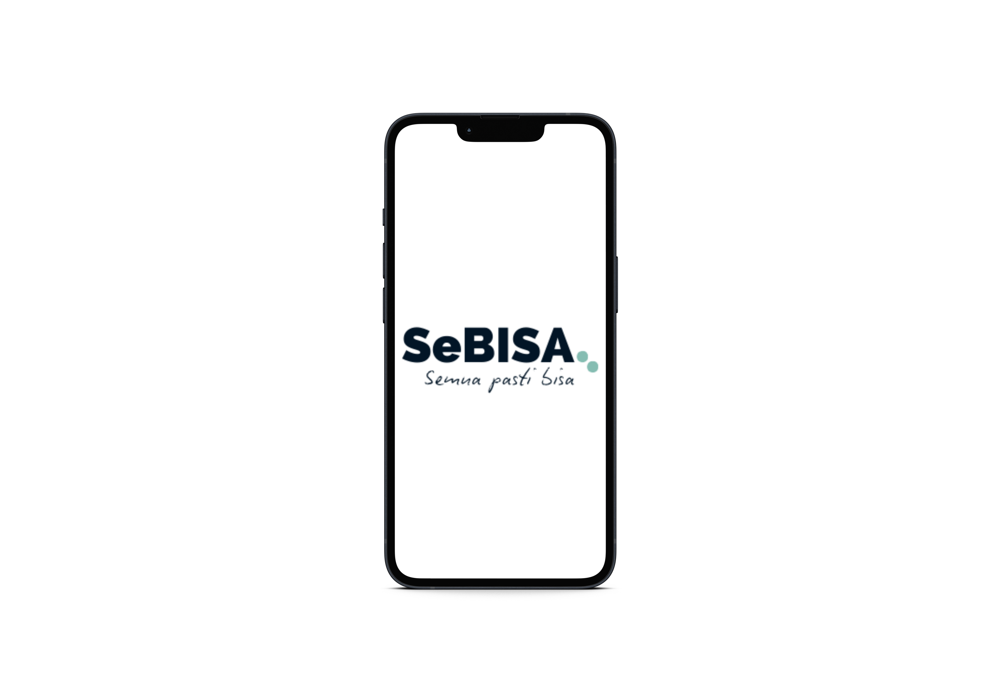
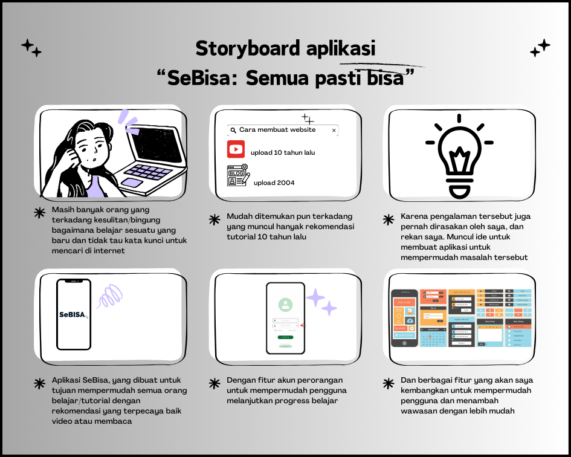
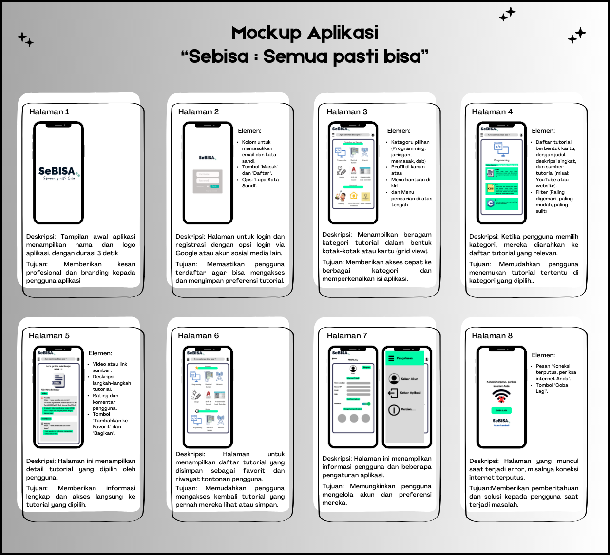
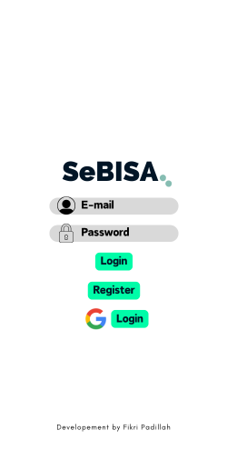
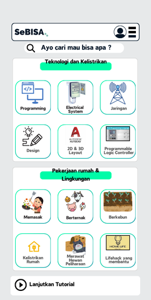
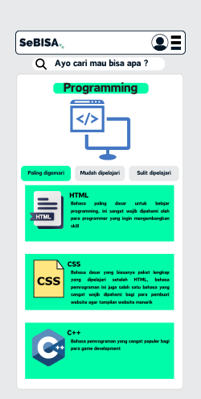
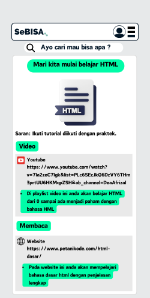
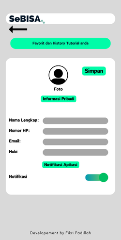

# UAS PEMPROGRAMAN MOBILE
***Nama : Fikri Padillah*** 
***Nim : 312310214*** 
***Kelas : TI.23.C3***

 

## Tech Stack
- Android Studio
- Kotlin

 

## Features
- Login
- Menampilkan tutorial yang relevan berupa video atau website

 

## SeBISA: Semua Pasti Bisa
 
<b>Overview</b>
 Sebuah aplikasi yang dibuat karena masalah pribadi dan masalah yang dialami teman sekitar. Aplikasi yang memudahkan pengguna yang ingin banyak belajar, tetapi sulit untuk mendapatkan sumber yang relevan.

## Storyboard

## Mockup

## User Interface SeBISA

 
<b>SeBISA Login Page</b>

## User Interface SeBISA

 
<b>SeBISA Menu</b>

## User Interface SeBISA

 
<b>SeBISA Tutorial Menu</b>

## User Interface SeBISA

 
<b>SeBISA Pilihan Tutorial</b>

## User Interface SeBISA

 
<b>SeBISA Profile Menu</b>

Credit by ***Fikri Padillah*** 
